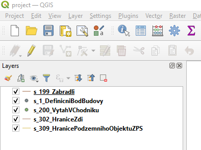
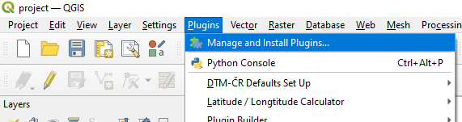
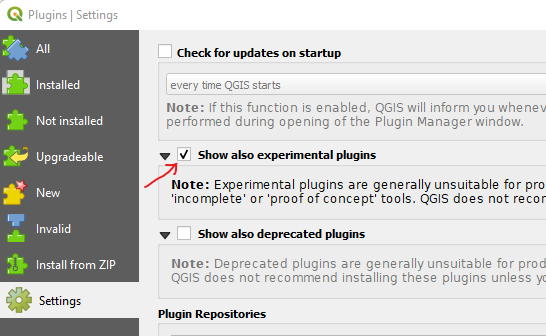
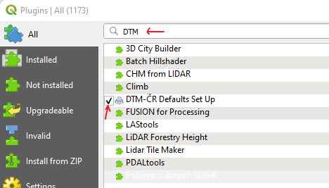
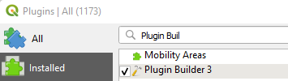
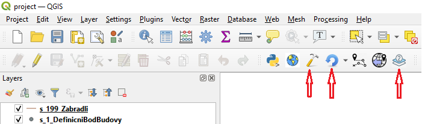
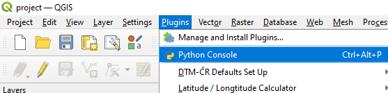
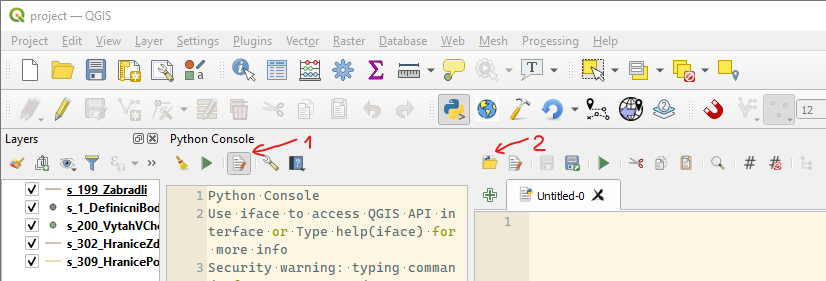

# Projekt: vývoj Qgis pluginu


## Odkazy
- [Plugin Tutorial QGIS OPS](https://gis-ops.com/qgis-3-plugin-tutorial-plugin-development-reference-guide/)
- [PyQgis Cookbook](https://docs.qgis.org/3.22/en/docs/pyqgis_developer_cookbook/plugins/index.html)
- [Qt for Python Docs](https://doc.qt.io/qtforpython/)

## Zadání
Vytvoření Qgis Pluginu za pomoci nástrujů Qgis Plugin Builder, Qt Designer a Qgis Desktop.

Funkčnost:  
- U vrstev v Qgis projektu  `.qgz/projekt.qgz` nastavovat pick-listy u atributů "obec" a "orp" podle toho jaké je aktuální "orp" v tabulce "step5_zps_bdef_objekty_dtmcr".
- U vrstev v Qgis projektu  `.qgz/projekt.qgz` nastavovat defaultní hodnoty u atributů "obec" a "orp" podle toho jaké je aktuální "orp" v tabulce "step5_zps_bdef_objekty_dtmcr".

## Struktura projektu
```bash
# tree -L 1 -a  --dirsfirst
# Složky začínající "." nepatří k souborům které generuje Qgis Plugin Builder
# Stejně tak soubory: README.md, .gitignore, qgis_py_console_script.py a vscode-qgis-ide.bat .
├── .docker
├── .git
├── .img
├── .qgz
├── .sql
├── help
├── i18n
├── scripts
├── test
├── .gitignore
├── Makefile
├── README.html
├── README.md
├── README.txt
├── __init__.py
├── icon.png
├── manage_layers.py
├── manage_layers_dialog.py
├── manage_layers_dialog_base.ui    #  UI design vytvořený v QtDesigneru
├── metadata.txt
├── pb_tool.cfg
├── plugin_upload.py
├── pylintrc
├── qgis_py_console_script.py       # Funkčnost pluginu jako skript do pyKonzole
├── resources.py
├── resources.qrc
└── vscode-qgis-ide.bat             # VS Code aware of Qgis py-interpreter
```
## Zprovoznění
Předpokladem je nainstalovaný docker a GIT na localhostu.

### Instalace Qgis  
- Stáhnout [Qgis](https://qgis.org/downloads/QGIS-OSGeo4W-3.22.12-1.msi)
    - Nainstalovat do složky `C:\OSGeo4W`. Součástí by měl být i Qt Designer.
- Qgis hledá pluginy ve složce
    - Windows: `C:\Users\USER\AppData\Roaming\QGIS\QGIS3\profiles\default\python\plugins`
    - Linux: `~/.local/share/QGIS/QGIS3/profiles/default/python/plugins`
- Nastavit symbolic link ze složky kde je Git repo projektu do složky kde Qgis hledá pluginy. 
 `mklink /D C:\FolderWhereQgisIsLookingForPlugins C:\WhereTheGitRepoOfProjectIs`
### Spuštění databáze Postgis 
- V terminálu s projektem navigovat so složky `.docker/` spustit Postgis a PgAdmin kontajnery příkazem `docker-compose up -d`. Kontajner s PostGIS databází by si měl sám připravit tabulky. Lze kontrolovat přes PgAdmina na `localhost:8080`, příhlášení přes login=pgadmin@pgadmin.org, heslo=admin.
### Spuštění Qgis Desktop
- Double click na projekt ve složce `.qgz\project.qgz` by se měl spustit Qgis s načteným projektem a s vrstvami:  

- Zobrazení pluginu  

- Povolit experimentální pluginy  

- Vyhledat a nainstalovat tyto pluginy:
    - DTM-ČR Defaults Set Up <<náš plugin>>
    
    - Plugin Builder  
    
    - Plugin Reloader  
    
- Zobrazení pluginů na liště v qgisu přes pravé tlačítko
    
    
    
- Tlačítka pluginů na liště
    

### Spuštění Python konzole v QGIS nebo IDE VS Code
- Python conosle a editor v Qgis  
    - Konzole  
      
    - Editor `->1..zpanout editor ->2..načíst *.py soubor` 
      
- IDE VS Code aware of qgis python interpreter
    - upravit soubor `vscode-qgis-ide.bat` a přes něj spustit VS Code.


